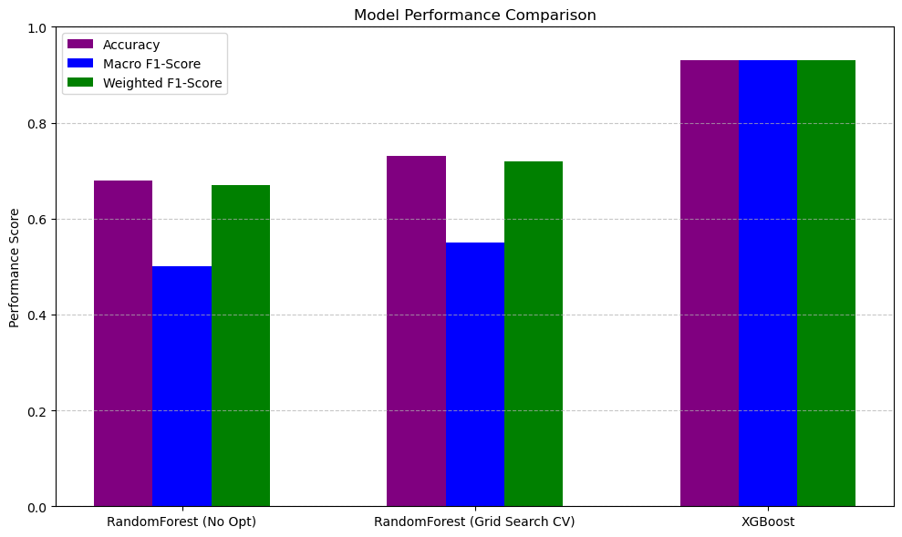

# Federal Reserve Rate Prediction

## Project Overview

This project aims to predict Federal Reserve interest rate movements (increase, decrease, or no change) using trends in consumer spending, specifically Personal Consumption Expenditures (PCE). By analyzing the relationship between consumer spending patterns and monetary policy decisions, our model seeks to provide actionable insights into economic indicators that influence Federal Reserve rate adjustments. This information can be valuable for mortgage lending, bond investing, and other financial decision.
## Project Objectives
- **Can PCE lead to predictions of the Federal Reserve interest rates?**
- **Which optimization model had the best accuracy score?**
- **How can predicting Federal Reserve rate movements benefit consumers and businesses?**

## Datasets
The project utilizes two primary datasets:
1. [Personal Consumption Expenditures](https://osuvirtaipt08-6bk3810.slack.com/archives/C083E88FB60/p1734190202376789) (PCE) by month (1959-2024 November).
2. [Federal Reserve Rate](https://fred.stlouisfed.org/series/FEDFUNDS) history by month.

Both datasets were reviewed to ensure sufficient data for training the model, and accessible APIs were confirmed for data retrieval.

## Data Collection and Cleanup
### Collection
- Data was collected from the BEA and FRED websites using their respective APIs.

### Cleanup
1. Extracted relevant rows from datasets while ignoring irrelevant data.
2. Combined year and month columns to create a date column.
3. Mapped months to numerical values and converted date strings to datetime format.
4. Dropped rows with missing data and saved the cleaned data into new DataFrames.

## Methodology
### Approach
1. Standard Deviation Classification.
2. Model Optimization:
   - Random Forest Model.
   - Grid Search CV (parameters: `min_sample_split`, `min_sample_leaf`, `min_weight_fraction_leaf`).
   - Extreme Gradient Boosting (XGBoost).
3. Time Series Analysis for better performance.

### Tools and Techniques
- **Python Libraries:** Pandas, NumPy, SciKit-Learn, XGBoost.
- **APIs:**
  - FRED API: [FRED API Documentation](https://fred.stlouisfed.org/docs/api/fred/series.html#series_id)
  - BEA API: [BEA API Documentation](https://osuvirtaipt08-6bk3810.slack.com/archives/C083E88FB60/p1734190202376789).

## Results
The project focuses on answering the following:
1. **Can PCE lead to predictions of the Federal Reserve interest rates?**
PCE in conjunction with the Consumer Price Index(CPI) and inflation rate are commonly referenced in Federal Reserve interest rate adjustments.

3. **Which model performed the highest in predicting the federal rate movement.**

4. **How can predicting Federal Reserve rate movements benefit consumers and businesses?**
   - [Chart Placeholder]

## Challenges Encountered
1. **Feature Scaling:**
   - Disparities in feature scales (e.g., PCE in hundreds of thousands versus Federal Reserve rates in decimals) caused model bias.
2. **Data Leakage and Overfitting:**
   - Switching to a Time Series Random Forest model initially caused data leakage and overfitting on the second feature.
3. **API Inconsistencies:**
   - API calls returned more data than the downloaded dataset.
4. **Dataset Size Limitations:**
   - Smaller datasets restricted the ability to use larger `n-estimator` values and sample splits.

## Future Considerations
- Explore additional predictors to enhance model accuracy.
- Address dataset limitations by integrating external data sources.
- Fine-tune the model further with advanced hyperparameter tuning techniques.
- Investigate additional use cases, such as predicting long-term interest rate trends.

## Team Members
- Andrew Holland
- Austin French
- Essence Doucet
- Johnathan Marsh
- Nathan Brown

## Repository Structure
- **`/data`:** Contains raw and cleaned datasets.
- **`/notebooks`:** Includes Jupyter Notebooks for data exploration, cleaning, and model training.
- **`/scripts`:** Python scripts for model training and evaluation.
- **`/results`:** Stores model outputs and evaluation metrics.
- **`README.md`:** Documentation of the project.

## Data Attribution
- **FRED API:** Data used in this project was sourced from the Federal Reserve Economic Data (FRED) API, provided by the Federal Reserve Bank of St. Louis. [Terms of Use](https://fred.stlouisfed.org/docs/api/terms_of_use.html)
- **BEA API:** Data used in this project was sourced from the U.S. Bureau of Economic Analysis (BEA) API. [Terms of Use](https://apps.bea.gov/API/signup/index.cfm)

